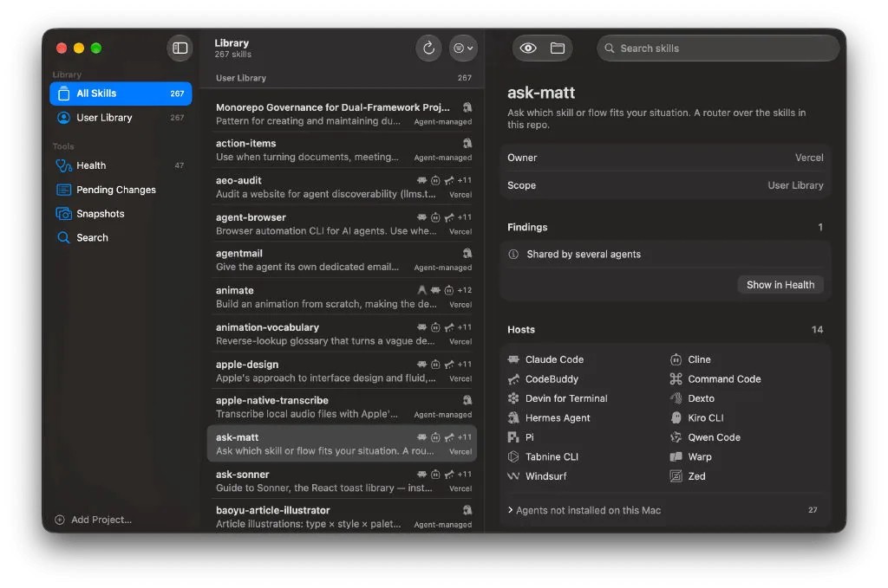

<div align="center">
  
  <h1>Sukiru</h1>
  <p><strong>轻巧、快速的原生 macOS 应用，用来检查和修复编程智能体的技能库</strong></p>

  <p>
    <a href="https://github.com/thedavidweng/sukiru/releases"></a>
    <a href="https://developer.apple.com/macos/"></a>
    <a href="https://www.swift.org"></a>
    <a href="#-安装指南"></a>
    <a href="PRIVACY.md"></a>
    <a href="LICENSE"></a>
  </p>

  <p>
    <a href="README.md"><strong>English</strong></a> •
    <a href="README_zh.md"><strong>简体中文</strong></a> •
    <a href="https://thedavidweng.github.io/sukiru/zh/"><strong>官网</strong></a>
  </p>

  <br />
  
</div>

---

**Sukiru** 用来检查和修复编程智能体的技能库。它通过调度两个官方安装器 `npx skills` 和 `gh skill` 来管理技能，自己从不维护任何安装账本。

智能体技能（含有 `SKILL.md` 的目录）由两个官方工具安装，它们各自记账：

- **Vercel `skills`**（`npx skills`）把安装记录写在锁文件里（项目级为 `skills-lock.json`，全局为 `~/.agents/.skill-lock.json`）。
- **GitHub CLI**（`gh skill`）把溯源信息写进每个技能 `SKILL.md` 的 frontmatter（`metadata.github-*`）。

两者写入同一批宿主目录，却互不读取对方的账本。受控实验（[冲突矩阵](docs/collision-matrix.md)）表明，这会在不知不觉中造成锁文件哈希过期、同一技能被两边同时记账、副本内容分叉，以及一个工具删掉另一个工具装的技能。手动复制的技能则构成第三类：没有任何安装器能更新或干净地卸载它们。

Sukiru 同时读取两份账本和磁盘上的实际情况，判断每个技能的归属，用通俗的语言解释每个问题，并把每项修复交给拥有该技能的那个工具去执行。

官网：<https://thedavidweng.github.io/sukiru/zh/>

---

## ✨ 核心特性

- 🩺 **健康报告**：问题按可处理的类型归组：过期的锁记录、失效链接、本该是链接却是副本、内容分叉的副本、来源未知的技能，以及归属冲突。健康的布局和长期提示收进「备注」。
- 🛠️ **一键修复**：单独修复一个问题，或「全部修复」。每次修复都生成一个命令批次，只需用通俗的说明确认一次，具体命令点一下即可查看。
- ↩️ **安全为先**：每个批次都按「快照 → 执行 → 比对」运行，可一键回滚。保留最近 10 个快照。
- 📚 **资源库**：查看每个技能的归属、溯源、固定的版本引用，以及它在各个宿主中的位置。可在链接和副本两种方式之间切换。
- 🔍 **搜索与安装**：搜索 skills.sh 和 `gh skill search`，预览 `SKILL.md`，然后用你选定的安装器安装，同样经过「确认 → 快照 → 回滚」流程。
- 🧭 **收编野技能**：为手动复制的技能查找可能的来源，并把它们交给某个安装器管理。
- 📴 **没有 CLI 也能用**：即使没装 Node.js 和 `gh`，Sukiru 依然是一个完整的只读健康检查工具。
- 🍎 **原生体验**：纯 Swift、SwiftUI 与 AppKit，只用系统控件，因此会跟随你的外观与辅助功能设置，并在 macOS 26 上呈现 Liquid Glass。支持英文和简体中文。

### 设计原则

- **零账本**：Sukiru 从不写入安装器的记录，账本的变更只通过官方 CLI 完成。只有在没有 CLI 提供的链接管理操作上（删除失效链接、用链接替换副本、把链接转成副本），Sukiru 才直接操作文件，而且总在快照保护之下。
- **按归属路由修复**：没有全局的「后端」设置。归属 `npx skills` 的技能用 `npx skills` 修复，归属 `gh skill` 的技能用 `gh skill` 修复。
- **无后台活动**：不监听文件系统，未经你同意不会下载或更新任何东西。应用只在启动时和你点击「刷新」时展示状态。
- **结果确定**：同样的磁盘状态总是产生同样的报告。
- **数据格式有误只会被报告为问题，绝不会导致崩溃。**

---

## 🚀 安装指南

### 系统要求

- 搭载 Apple 芯片、运行 macOS 14 Sonoma 或更高版本的 Mac。
- 可选，用于执行更改：
  - [Node.js](https://nodejs.org/en/download)，用于 `npx skills`。
  - [GitHub CLI](https://cli.github.com) 2.90.0 或更高版本，用于 `gh skill`。

Sukiru 会在启动时检测这两个工具，缺少哪个工具，就只停用依赖它的操作。它和终端一样通过登录 shell 的 PATH 查找工具，所以无论 Node.js 来自 Homebrew 还是版本管理器（mise、fnm、nvm、Volta、asdf、nodenv），都无需额外设置。如果你在用版本管理器但还没装 Node.js，「设置 › 安装器」会提示你用它安装，而不是推荐 Homebrew。`skills` CLI 无需安装：只要有 Node.js，你第一次确认需要它的更改时，`npx` 就会下载它，确认窗口会提前说明。Sukiru 从不自行下载或更新它；「设置 › 安装器」也提供「下载」（提前获取）和「更新」（有新版本时）按钮，由你决定。

### 通过 Homebrew 安装（推荐）

```bash
brew install --cask thedavidweng/tap/sukiru
```

后续更新：

```bash
brew upgrade --cask sukiru
```

Homebrew cask 会自动移除隔离标记，首次启动不会被 Gatekeeper 拦截。

### 手动下载

1. 前往 [GitHub Releases](https://github.com/thedavidweng/sukiru/releases) 下载 `Sukiru.dmg`。每个版本都在 `checksums.txt` 中附有 SHA-256 校验值。
2. 将 **Sukiru.app** 拖拽至 `/Applications`（应用程序）目录。
3. 从启动台或聚焦搜索打开应用。

> [!NOTE]
> 发行版本采用临时签名（ad-hoc），未经 Apple 公证。若 Gatekeeper 阻止启动，请打开 **系统设置 › 隐私与安全性**，在 Sukiru 相关提示旁点击 **仍要打开**（在 macOS 14 上也可以右键点击 **Sukiru.app** 并选择 **打开**），或在终端执行：
> `xattr -cr /Applications/Sukiru.app`

---

## 📖 快速上手

1. 启动 Sukiru，它会自动扫描用户级的技能目录。
2. 如需包含项目级技能，请把项目文件夹添加为项目根目录（**显示 › 添加项目根目录…**、`⇧ ⌘ A`，或在设置中添加）。
3. 打开 **健康**，查看问题及其成因。点击问题旁的修复按钮，或点击 **全部修复**。
4. 检查确认面板后确认执行。如需撤销，可在结果页操作，或使用 **修复 › 回滚选中的批次**。

---

## ⌨️ 常用快捷键

| 操作 | 快捷键 |
| :--- | :--- |
| **资源库 / 健康 / 待处理更改 / 快照 / 搜索** | `⌘ 1` – `⌘ 5` |
| **刷新** | `⌘ R` |
| **添加项目根目录…** | `⇧ ⌘ A` |
| **快速查看所选技能** | `⌘ Y` |
| **查看所选技能的发现** | `⇧ ⌘ F` |
| **在资源库中显示所选发现对应的技能** | `⇧ ⌘ L` |
| **展开或收起所选发现的证据** | `⇧ ⌘ E` |
| **显示下一个 / 上一个工作区** | `⌥ ⌘ →` / `⌥ ⌘ ←` |
| **运行搜索** | `⌘ K` |
| **安装所选技能…** | `⇧ ⌘ I` |
| **修复选中的发现项…** | `⌥ ⌘ F` |
| **执行批次** | `⌥ ⌘ E` |
| **放弃批次** | `⌥ ⌘ X` |
| **回滚选中的批次** | `⌥ ⌘ B` |
| **设置** | `⌘ ,` |

所有命令也都列在 **显示**、**搜索** 和 **修复** 菜单中。

---

## 🛡️ 隐私与系统权限

Sukiru 没有账户、分析或遥测。它读取本地文件，并在你的 Mac 上运行官方 CLI。只有在向 npm registry 查询 `skills` CLI 的最新版本号、在你搜索（skills.sh 搜索 API 和 `gh skill search`）、从 GitHub 预览技能的 `SKILL.md`，或运行需要联网的 CLI 命令时，它才会访问网络。快照和执行记录保存在 `~/Library/Application Support/Sukiru`。

详细说明参见 [PRIVACY.md](PRIVACY.md)。

---

## 💻 命令行工具

`sukiru-cli` 提供同一套引擎，便于编写脚本和测试：

```bash
swift run sukiru-cli scan           # 输出 JSON 格式的健康报告
swift run sukiru-cli capabilities   # 检测到的安装器及其版本
swift run sukiru-cli batch …        # 根据决策文件生成或执行修复批次
swift run sukiru-cli rollback …     # 恢复某个批次的快照
```

`SUKIRU_HOME` 会在所有路径解析中替代 `$HOME`，`SUKIRU_ROOTS` 用于添加以冒号分隔的项目根目录。详见 [CONTRIBUTING.md](CONTRIBUTING.md)。

---

## 🧱 从源码构建

### 环境要求

- macOS 14.0+
- Xcode 26+（Swift 6.2）
- [XcodeGen](https://github.com/yonaskolb/XcodeGen)

### 编译与运行

```bash
git clone https://github.com/thedavidweng/sukiru.git
cd sukiru

swift test                 # 核心库与 CLI 测试
Scripts/build-app.sh       # 生成 Xcode 项目并构建 Sukiru.app
Scripts/run-app.sh         # 运行调试版应用
```

完整的开发流程、质量检查与测试安全规则参见 [CONTRIBUTING.md](CONTRIBUTING.md)。

---

## 📄 文档与参与贡献

- 官网：<https://thedavidweng.github.io/sukiru/zh/>
- 代码与界面中使用的领域术语：[CONTEXT.md](CONTEXT.md)
- 架构决策记录：[docs/adr](docs/adr/README.md)
- 两个官方安装器相互影响的实验：[冲突矩阵](docs/collision-matrix.md)
- 贡献指南与质量检查：[CONTRIBUTING.md](CONTRIBUTING.md) 及 [行为准则](CODE_OF_CONDUCT.md)
- 问题反馈与功能建议：[GitHub Issues](https://github.com/thedavidweng/sukiru/issues)
- 安全问题：请按 [SECURITY.md](SECURITY.md) 私下报告，不要公开提交 issue。

以上文档目前均为英文。

### 项目历史

Sukiru 的前身是「Gino」，一个用 Rust/GPUI 重新实现 `skills` CLI 的项目。2026 年 9 月，它被重建为原生 Swift 应用，所有安装器写入都交给官方工具完成（[ADR-0001](docs/adr/0001-pivot-to-zero-ledger-referee.md)）。旧实现保留在 [`archive/rust-gui`](https://github.com/thedavidweng/sukiru/tree/archive/rust-gui) 分支上以供参考。

---

## ⚖️ 许可证

版权所有 © 2026 David Weng。基于 [Apache License 2.0](LICENSE) 许可证发布。

各智能体的标志仅用于标识兼容的工具，其权利归各自所有者。来源与许可信息列于 [`App/Resources/AgentIcons-LICENSE.txt`](App/Resources/AgentIcons-LICENSE.txt)。
